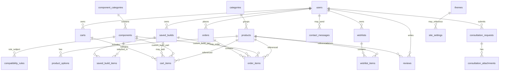

# CustomCore — Database Entity-Relationship Design

**Document type:** Stage 0 planning (Commit 0.6)  
**Purpose:** Define normalized MySQL tables and relationships before writing `database/schema.sql` in Stage 2.  
**Acceptance:** All major feature relationships are represented.  
**Engine (planned):** MySQL / InnoDB, `utf8mb4`  
**Access layer:** PHP PDO with prepared statements only (`includes/database.php` → `customcore_pdo()`, Commit 1.3)

This document is the design contract. Executable SQL and seeds live in `database/`. Import, verification, and backup steps are documented in [`docs/database-import.md`](database-import.md) (Commit 2.8).

---

## 1. Design goals

| Goal | Approach |
| ---- | -------- |
| ≥ 20 catalogue products with ≥ 2 options each | `products` + `product_options` |
| Custom PC builder | `component_categories` + `components` + `compatibility_rules` |
| Accounts and roles | `users` (`customer` / `admin`, `is_active`) |
| Saved builds, wishlist, cart, orders | Own tables + line-item tables |
| Reviews and consultations | Moderated `reviews`; `consultation_requests` + `consultation_attachments` |
| Themes | `themes` + `site_settings` (active theme key) |
| No secrets in Git | Credentials only in ignored `config/database.php` |
| No real payment data | `orders.payment_method` stores a label only |

---

## 2. Entity-relationship diagram



### Relationship notes (cardinality)

| Parent | Child | Rule |
| ------ | ----- | ---- |
| `categories` | `products` | One category has many products; each product belongs to one category |
| `products` | `product_options` | One product has many options; each option belongs to one product (**≥ 2 options per product**) |
| `users` | `saved_builds` | One user has many builds; build ownership enforced in queries |
| `saved_builds` | `saved_build_items` | One build has many component lines |
| `users` | `wishlists` | Typically one active wishlist per user (unique `user_id`) |
| `wishlists` | `wishlist_items` | Wishlist lines point at products |
| `users` | `carts` | Typically one active cart per user |
| `carts` | `cart_items` | Lines may reference a product **or** a saved build / custom selection |
| `users` | `orders` | One user has many orders |
| `orders` | `order_items` | Frozen line snapshot at checkout |
| `users` / `products` | `reviews` | Review belongs to one user and one product; public view only when approved |
| `users` | `consultation_requests` | One user has many requests |
| `consultation_requests` | `consultation_attachments` | Optional safe uploads per request |
| `component_categories` | `components` | Builder inventory grouped by type |
| `components` | `compatibility_rules` | Rules store simplified attributes/constraints used by the checker |
| `themes` / `site_settings` | — | Active theme selected via settings row(s) |

---

## 3. Complete table plan

Unless noted, every table includes `id` (PK, UNSIGNED INT AUTO_INCREMENT) and useful `created_at` / `updated_at` timestamps.

### 3.1 Identity and access

#### `users`
| Column | Type (planned) | Notes |
| ------ | -------------- | ----- |
| `id` | PK | |
| `email` | VARCHAR(255) UNIQUE | Login identity |
| `password_hash` | VARCHAR(255) | `password_hash()` / `password_verify()` only |
| `first_name`, `last_name` | VARCHAR | Profile |
| `phone` | VARCHAR(30) NULL | |
| `address_line1`, `address_line2`, `city`, `province`, `postal_code` | VARCHAR | Shipping/profile |
| `role` | ENUM(`customer`,`admin`) | Authorization |
| `is_active` | TINYINT(1) | Admin can disable; disabled users cannot log in |
| `created_at`, `updated_at` | DATETIME | |

**Indexes:** unique `email`; index on `role`, `is_active`.

---

### 3.2 Catalogue

#### `categories`
| Column | Notes |
| ------ | ----- |
| `id` PK | |
| `name` | e.g. Budget, Esports, High-Performance, Creator |
| `slug` UNIQUE | URL/filter key |
| `description` | |
| `sort_order` | Display order |
| `is_active` | |

#### `products`
| Column | Notes |
| ------ | ----- |
| `id` PK | |
| `category_id` FK → `categories.id` | Tier |
| `name`, `slug` UNIQUE | |
| `brand` | Filter/search |
| `short_description`, `description` | |
| `base_price` DECIMAL(10,2) | Before options |
| `stock_quantity` INT | |
| `image_path` | Under `assets/images/` or `uploads/products/` |
| `is_featured` | Homepage |
| `is_active` | Soft-disable without delete |
| Spec snapshot fields (optional) | e.g. CPU/GPU labels for compare cards |
| timestamps | |

**Indexes:** `category_id`, `is_active`, `base_price`, `brand`, `is_featured`.

#### `product_options`
| Column | Notes |
| ------ | ----- |
| `id` PK | |
| `product_id` FK → `products.id` | ON DELETE CASCADE |
| `option_group` | e.g. RAM, Storage, Colour, Warranty, OS, Cooling, GPU |
| `option_label` | e.g. `32 GB` |
| `price_delta` DECIMAL(10,2) | Added to base price |
| `is_default` | Default selection |
| `is_active` | |
| `sort_order` | |
| timestamps | |

**Constraint (app + verification query):** every active product must have **≥ 2** active options.

---

### 3.3 Custom builder inventory

#### `component_categories`
| Column | Notes |
| ------ | ----- |
| `id` PK | |
| `name`, `slug` UNIQUE | CPU, Motherboard, GPU, RAM, Storage, PSU, Case, Cooling, OS, Service |
| `sort_order` | Builder step order |
| `is_required` | Whether builder requires a selection |

#### `components`
| Column | Notes |
| ------ | ----- |
| `id` PK | |
| `component_category_id` FK | |
| `name`, `brand` | |
| `price` DECIMAL(10,2) | |
| `wattage_estimate` INT NULL | For PSU checks |
| `socket` VARCHAR NULL | CPU / motherboard |
| `ram_type` VARCHAR NULL | e.g. DDR4/DDR5 |
| `form_factor` VARCHAR NULL | Motherboard / case size |
| `gpu_length_mm` INT NULL | |
| `cooler_height_mm` INT NULL | |
| `cooler_type` VARCHAR NULL | air / liquid |
| `storage_interface` VARCHAR NULL | e.g. NVMe, SATA |
| `performance_gaming` TINYINT NULL | 1–100 style score for charts |
| `performance_productivity` TINYINT NULL | |
| `image_path` | optional |
| `is_active` | |
| timestamps | |

#### `compatibility_rules`
Stores **simplified** rule metadata and/or attribute expectations used by PHP/JS checkers (not a full commercial parts graph).

| Column | Notes |
| ------ | ----- |
| `id` PK | |
| `rule_code` UNIQUE | e.g. `socket_match`, `ram_type_match`, `case_motherboard`, `psu_wattage`, `gpu_clearance`, `cooler_fit`, `storage_interface` |
| `name`, `description` | Human-readable explanation templates |
| `severity` | `error` (incompatible) or `warning` |
| `is_active` | |
| Optional JSON/text `config` | Thresholds or allowed pairs if needed |
| timestamps | |

Actual pass/fail uses component attribute columns compared in application logic (Stage 5), guided by these rule records.

---

### 3.4 Saved builds

#### `saved_builds`
| Column | Notes |
| ------ | ----- |
| `id` PK | |
| `user_id` FK → `users.id` | Owner-only access |
| `name` | |
| `total_price` DECIMAL(10,2) | Server-calculated |
| `compatibility_status` | `compatible` / `warning` / `incompatible` |
| `notes` TEXT NULL | |
| timestamps | |

#### `saved_build_items`
| Column | Notes |
| ------ | ----- |
| `id` PK | |
| `saved_build_id` FK | CASCADE |
| `component_id` FK | |
| `unit_price` DECIMAL(10,2) | Snapshot |
| Unique (`saved_build_id`, `component_category` or `component_id`) as appropriate | One part per category preferred |

---

### 3.5 Wishlist

#### `wishlists`
| Column | Notes |
| ------ | ----- |
| `id` PK | |
| `user_id` FK UNIQUE | One wishlist per user |

#### `wishlist_items`
| Column | Notes |
| ------ | ----- |
| `id` PK | |
| `wishlist_id` FK | |
| `product_id` FK | |
| Unique (`wishlist_id`, `product_id`) | |
| timestamps | |

---

### 3.6 Cart

#### `carts`
| Column | Notes |
| ------ | ----- |
| `id` PK | |
| `user_id` FK UNIQUE | Persisted cart for account |
| timestamps | |

#### `cart_items`
| Column | Notes |
| ------ | ----- |
| `id` PK | |
| `cart_id` FK | |
| `item_type` | `product` or `saved_build` (extendable) |
| `product_id` FK NULL | When prebuilt |
| `saved_build_id` FK NULL | When custom build |
| `quantity` INT | ≥ 1 |
| `unit_price` DECIMAL(10,2) | Server-trusted |
| `options_json` TEXT NULL | Selected product option IDs/labels snapshot |
| timestamps | |

---

### 3.7 Orders (simulated checkout)

#### `orders`
| Column | Notes |
| ------ | ----- |
| `id` PK | |
| `user_id` FK | |
| `order_number` UNIQUE | Public confirmation code |
| `status` | e.g. `pending`, `processing`, `ready`, `completed`, `cancelled` |
| `subtotal`, `total` DECIMAL(10,2) | |
| Shipping/contact snapshot columns | Name, phone, address fields |
| `payment_method` | **Label only** (e.g. `pay_on_pickup`) — never card numbers |
| `admin_notes` TEXT NULL | |
| timestamps | |

#### `order_items`
| Column | Notes |
| ------ | ----- |
| `id` PK | |
| `order_id` FK | CASCADE |
| `item_type` | `product` or `saved_build` |
| `product_id` / `saved_build_id` NULL | Reference if still available |
| `item_name` | Frozen display name |
| `quantity` | |
| `unit_price`, `line_total` | Frozen |
| `options_json` / `build_snapshot_json` | Frozen detail for history |

---

### 3.8 Reviews and support

#### `reviews`
| Column | Notes |
| ------ | ----- |
| `id` PK | |
| `product_id` FK | |
| `user_id` FK | |
| `rating` TINYINT | 1–5 |
| `title`, `body` | |
| `status` | `pending` / `approved` / `hidden` |
| timestamps | |

Public pages show **approved** only.

#### `consultation_requests`
| Column | Notes |
| ------ | ----- |
| `id` PK | |
| `user_id` FK | |
| `budget`, `games`, `software`, `performance_goals` | Form fields |
| `notes` TEXT | |
| `status` | `open` / `in_progress` / `answered` / `closed` |
| `admin_response` TEXT NULL | |
| `responded_at` NULL | |
| timestamps | |

#### `consultation_attachments`
| Column | Notes |
| ------ | ----- |
| `id` PK | |
| `consultation_request_id` FK | CASCADE |
| `original_filename` | Display only |
| `stored_filename` | Generated safe name |
| `mime_type`, `file_size` | Validation metadata |
| `created_at` | |

#### `contact_messages`
| Column | Notes |
| ------ | ----- |
| `id` PK | |
| `user_id` FK NULL | Optional if logged in |
| `name`, `email`, `subject`, `message` | |
| `is_read` | Admin |
| timestamps | |

---

### 3.9 Themes and settings

#### `themes`
| Column | Notes |
| ------ | ----- |
| `id` PK | |
| `name` | RGB Gaming, Minimal Professional, Cyber Grid |
| `slug` UNIQUE | |
| `css_file` | e.g. `assets/themes/rgb-gaming.css` |
| `is_active_default` | Fallback candidate |
| timestamps | |

#### `site_settings`
| Column | Notes |
| ------ | ----- |
| `id` PK | |
| `setting_key` UNIQUE | e.g. `active_theme_id` |
| `setting_value` | String / id reference |
| timestamps | |

---

## 4. Feature → table mapping

| Feature area | Tables |
| ------------ | ------ |
| Catalogue / search / filters | `categories`, `products`, `product_options` |
| Product reviews | `reviews`, `users`, `products` |
| PC Builder + compatibility | `component_categories`, `components`, `compatibility_rules` |
| Saved builds | `saved_builds`, `saved_build_items` |
| Wishlist | `wishlists`, `wishlist_items` |
| Cart / checkout / history | `carts`, `cart_items`, `orders`, `order_items` |
| Consultations + uploads | `consultation_requests`, `consultation_attachments` |
| Contact form | `contact_messages` |
| Auth / admin disable user | `users` |
| Theme switching | `themes`, `site_settings` |
| Monitoring counts | Aggregations across products, users, orders, requests, stock |

---

## 5. Planned verification queries (Stage 2+)

Confirm ≥ 20 active products:

```sql
SELECT COUNT(*) AS active_products
FROM products
WHERE is_active = 1;
```

Confirm every active product has at least two active options:

```sql
SELECT p.id, p.name, COUNT(po.id) AS option_count
FROM products p
LEFT JOIN product_options po
  ON po.product_id = p.id AND po.is_active = 1
WHERE p.is_active = 1
GROUP BY p.id, p.name
HAVING COUNT(po.id) < 2;
```

**Expected result for a valid seed:** zero rows from the second query.

---

## 6. Simplified compatibility attributes (builder)

Rules implemented in application code (Stage 5), using component columns:

1. CPU socket = motherboard socket  
2. RAM type = motherboard RAM type  
3. Motherboard form factor fits case  
4. PSU wattage ≥ estimated build requirement  
5. Case supports GPU length  
6. Case supports cooler type/height  
7. Motherboard supports storage interface  

Results: **compatible** / **warning** / **incompatible**, with explanations. Server validates independently of JavaScript.

---

## 7. Security and data rules

| Rule | Design impact |
| ---- | ------------- |
| Prepared statements only | No string-concatenated SQL in PHP |
| Password hashing | Store only `password_hash` |
| Owner checks | `user_id` on private rows; admins exempt where appropriate |
| Uploads | Generated filenames; MIME/size checks; path under `uploads/consultation/` |
| Checkout | No card number / CVV / banking secret columns exist |
| Exports for Git | Seeds use fake users only; no real customer dumps |

---

## 8. Stage 2 deliverables (implementation status)

| Commit | Deliverable | Status |
| ------ | ----------- | ------ |
| 2.1 | `database/schema.sql` implementing this plan | Done |
| 2.2–2.3 | Product + option seeds (≥ 20 × ≥ 2 options) | Done |
| 2.4–2.5 | Component + compatibility seeds | Done |
| 2.6 | Theme + settings seeds | Done |
| 2.7 | Secure admin creation script (hashed password, not plain text in Git) | Done |
| 2.8 | Import guide (`docs/database-import.md`) + this doc aligned to live schema | Done |

---

## 8a. Import, backup, and ER alignment (Commit 2.8)

**Full step-by-step guide:** [`docs/database-import.md`](database-import.md)

### Quick import sequence

1. Create a utf8mb4 database and `config/database.php` (from the example).  
2. Import `database/schema.sql`.  
3. Import seeds in order: products → product-options → components → compatibility → themes.  
4. Run `php database/create-admin.php` for a bcrypt-hashed admin.  
5. Run the verification queries in the import guide (20 products; zero products with &lt; 2 options; builder categories populated; 7 rules; active theme readable).

### ER alignment note

The Mermaid diagram and table plan in this document match the 21 tables created by `database/schema.sql`. Seed files populate catalogue, builder, compatibility, and theme rows required by Stage 2 acceptance. Application features that use empty transactional tables (cart, orders, reviews, etc.) arrive in later stages; the relationships are already present in the schema.

**Source of truth for executable SQL:** `database/schema.sql` and the `database/seed-*.sql` files. Keep this design document updated when those files change.

---

## 9. Table inventory checklist

| # | Table | In ER diagram | Feature covered |
| - | ----- | ------------- | --------------- |
| 1 | `users` | Yes | Auth, profile, admin disable |
| 2 | `categories` | Yes | Catalogue tiers |
| 3 | `products` | Yes | 20+ prebuilts |
| 4 | `product_options` | Yes | ≥ 2 options each |
| 5 | `component_categories` | Yes | Builder steps |
| 6 | `components` | Yes | Builder parts |
| 7 | `compatibility_rules` | Yes | Compatibility engine metadata |
| 8 | `saved_builds` | Yes | Save builds |
| 9 | `saved_build_items` | Yes | Build lines |
| 10 | `wishlists` | Yes | Wishlist header |
| 11 | `wishlist_items` | Yes | Wishlist lines |
| 12 | `carts` | Yes | Persistent cart |
| 13 | `cart_items` | Yes | Cart lines |
| 14 | `orders` | Yes | Simulated checkout |
| 15 | `order_items` | Yes | Order history detail |
| 16 | `reviews` | Yes | Ratings + moderation |
| 17 | `consultation_requests` | Yes | Consultations |
| 18 | `consultation_attachments` | Yes | Safe uploads |
| 19 | `contact_messages` | Yes | Contact form |
| 20 | `themes` | Yes | Three templates |
| 21 | `site_settings` | Yes | Active theme + settings |

**Commit 0.6 acceptance:** All major CustomCore features have tables and relationships represented above.

---

## 10. Status

**Stage 3 in progress (Commit 3.6).** Schema, catalogue seeds, builder seeds, compatibility rules, themes/settings, secure admin setup, and the import/backup guide (`docs/database-import.md`) are in place. Public catalogue pages are live — homepage, about, catalogue with filters/sort, product detail, search, all driven by MySQL.
